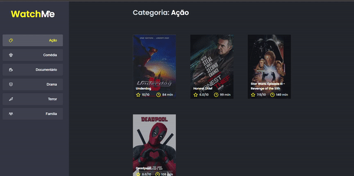

<h1 align="center">
  Watch Me
</h1>

- - -

<h1>Preview</h1>

  

 

## Tecnologias

Esse projeto foi desenvolvido com as seguintes tecnologias:

- HTML
- SASS
- REACT 
- TYPESCRIPT
- FAKE API com JSON Server

## Projeto

 Para rodar esse código em sua máquina, basta usar os comandos: 

 - yarn 
 - yarn server 
 - yarn dev

 Esse projeto é um desafio da Rocketseat da trilha de ReactJs, onde o foco dele foi fazer a componentização da aplicação. Onde a aplicação vinha toda concentrada no componente App e foi dividida em Sidebar e Content, com isso foi revisado o conceito de elevação de estado, onde um componente Pai passa para os seus componentes filhos propriedades para que eles possam funcionar de forma "independente".
- - -

 Template desenvolvido pela Rocketseat como desafio, e componentização feita por Enan Dorta